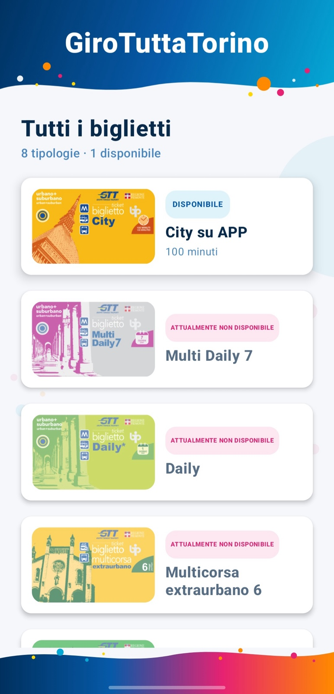
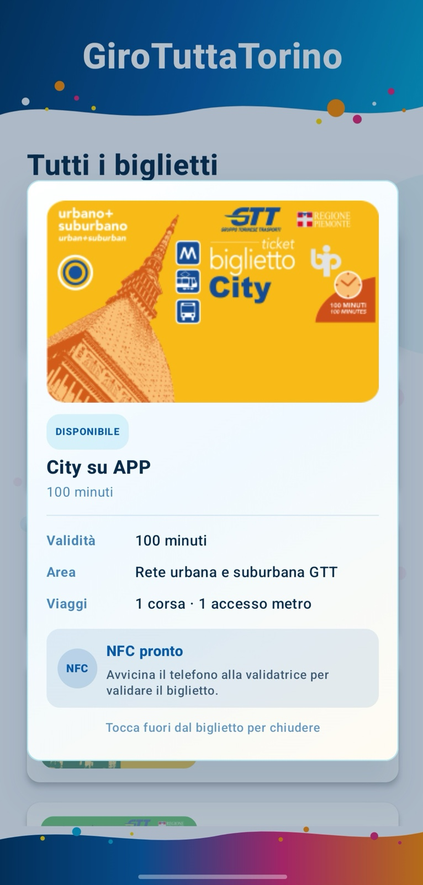
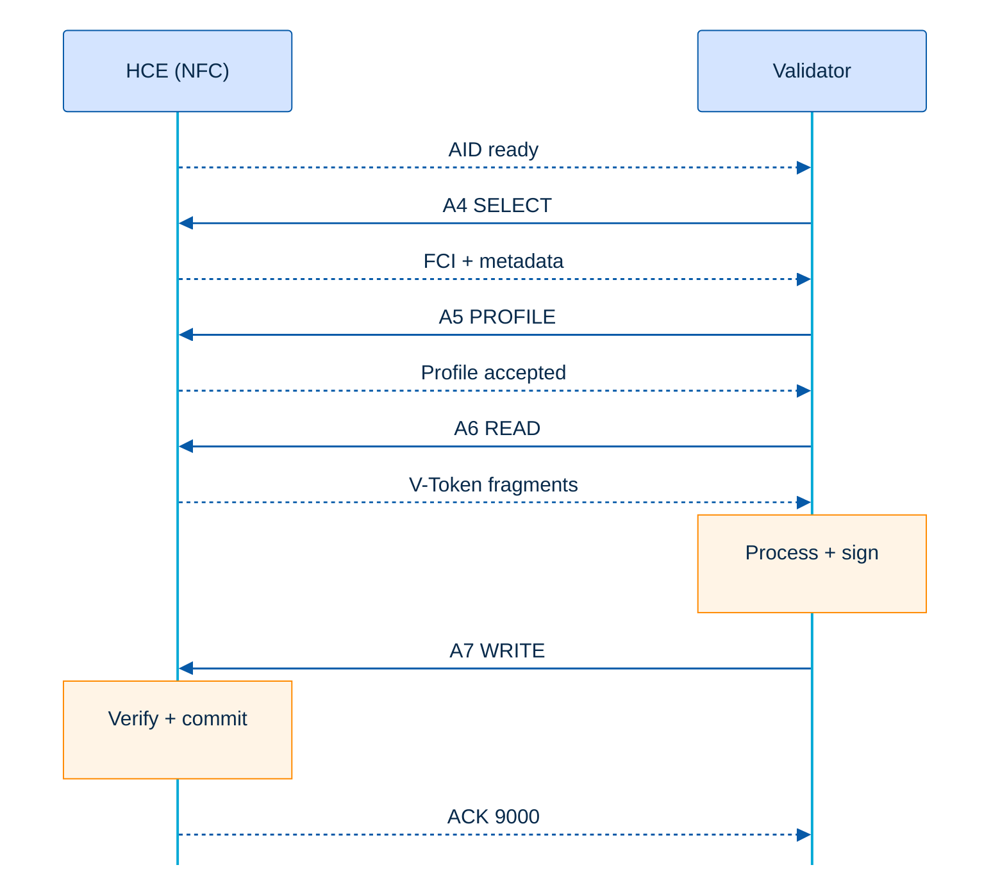

  

  <h1>GTT - Giro Tutta Torino</h1>

## Introduction

GTT - Giro Tutta Torino is an Android application developed through reverse engineering of GTT's TO Move application. It reproduces the NFC ticket-presentation flow used to transmit an electronic transit ticket from an Android device to a compatible validator.

The project focuses on accurately reproducing the communication between the mobile device and the validator, from presenting the ticket to receiving and storing the updated ticket returned after validation.

## Application preview

<table>
  <tr>
    <td align="center" width="50%">
      
       
      <strong>Ticket catalog</strong>
       
      Available and unavailable fare products
    </td>
    <td align="center" width="50%">
      
       
      <strong>NFC-ready ticket</strong>
       
      Expanded ticket ready for validator presentation
    </td>
  </tr>
</table>

## How it works

The application can manage a legitimate GTT electronic ticket purchased through the TO Move store. It preserves the original pre-validation state and, when the active validity period expires, automatically makes the same ticket available again for a new validation cycle.

- An active ticket can be reused without a presentation limit until the validity end time encoded in its payload.

To enable a ticket in the application, its data must first be extracted from the official TO Move application and then loaded into GTT - Giro Tutta Torino. Once loaded, the application automatically identifies the ticket type, activates the corresponding ticket card, and makes it available for NFC validation.

> ⚠️ **Disclaimer**
>
> This project does not explain how to extract an electronic ticket from the TO Move application or how to import a valid purchased ticket into this application. The author assumes no responsibility for the use or misuse of the application.

## Reverse engineering core

The diagram below isolates the NFC exchange between Android Host Card Emulation (HCE) and the validator. While a ticket is open, the phone exposes the GTT application identifier and processes the validator commands through a strict, stateful APDU sequence.

- **NFC ready** — Opening the ticket activates the HCE session and temporarily exposes the GTT AID to the validator.
- **A4 — Application selection** — The validator selects the HCE application; the phone returns the FCI containing the Device UID, active V-Token length, and protocol metadata.
- **A5 — Profile negotiation** — The validator declares its type, subtype, transport mode, and key index, and the phone accepts a supported profile.
- **A6 — Active ticket read** — The validator requests the active V-Token by offset and correlation ID; the phone returns the ordered ticket fragments.
- **Validator processing** — The validator evaluates the ticket, updates the V-Token, and signs it again to guarantee its integrity.
- **A7 — Ticket write-back** — The updated V-Token is returned from offset zero with write mode, completion flag, correlation ID, and one or more ordered fragments.
- **Verification and commit** — After the final fragment, the phone verifies the complete transition, atomically replaces the active ticket, and returns an acknowledgement ending in `9000`. An incomplete A7 exchange is discarded.

### Electronic ticket example — before and after validation

This comparison includes only the principal fields whose values changed in the observed electronic ticket during validation. Stable identifiers and unchanged structural fields are omitted.

| Field | Before validation | After validation |
| --- | ---: | ---: |
| Signature count | `3` | `4` |
| State flags | `0` | `14` |
| First validation | — | 12 March 2025, 09:45 CET |
| Last validation | — | 12 March 2025, 09:45 CET |
| Contract ID | `0` | `12345678901234567890` |
| Operator ID | `0` | `1` |
| Class ID | `0` | `5` |
| Ride ID | `0` | `801` |
| Node ID | `0` | `8` |
| Minutes to go | `0` | `100` |
| Metro admission | `1` | `0` |
| Integrity trailer length | `47` | `45` |
| V-Token length | `208` | `206` |
