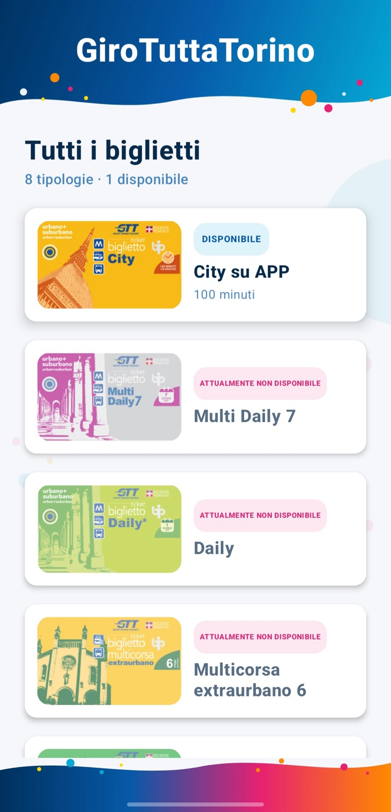
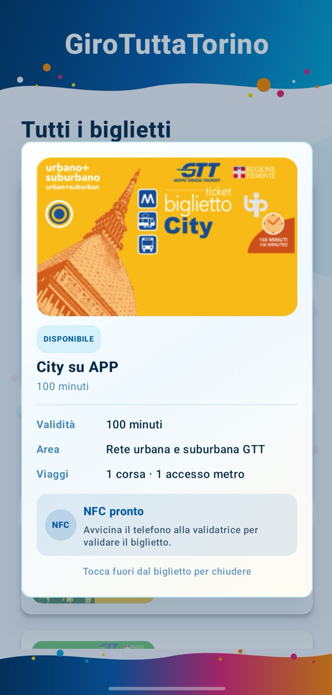
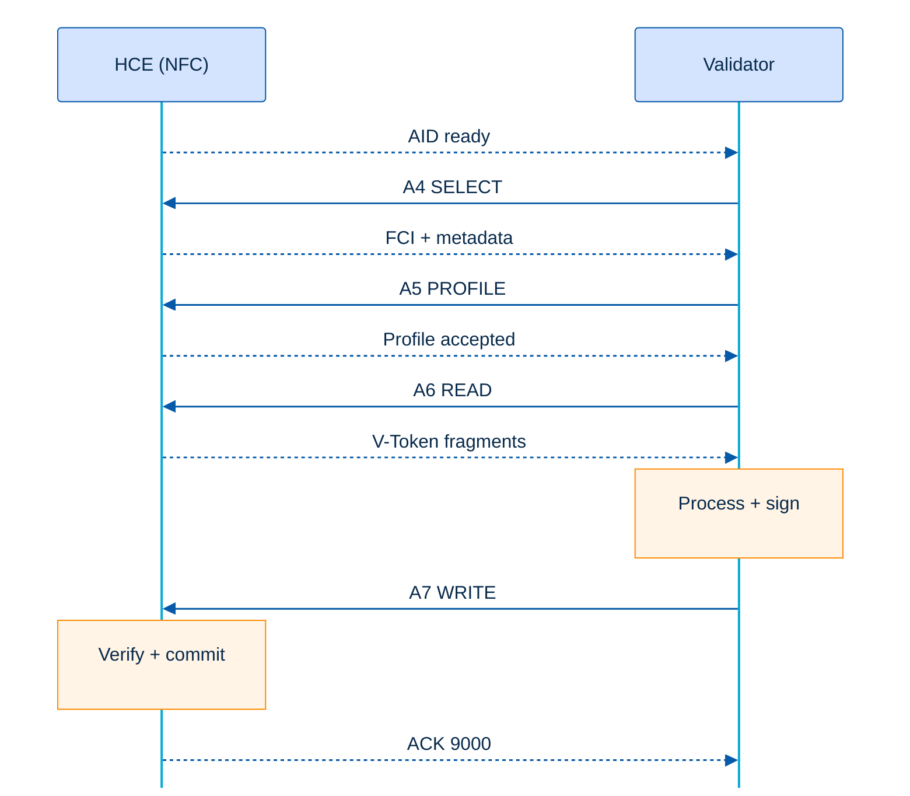

  

  <h1>GTT - Giro Tutta Torino</h1>

## Introduction

GTT - Giro Tutta Torino is an Android application developed through reverse engineering of GTT's TO Move application. It reproduces the NFC ticket-presentation flow used to transmit an electronic transit ticket from an Android device to a compatible validator.

The project focuses on accurately reproducing the communication between the mobile device and the validator, from presenting the ticket to receiving and storing the updated ticket returned after validation.

## Application preview

  
  &emsp;&emsp;&emsp;
  

  &ensp;<strong>Ticket catalog</strong>
  &emsp;&emsp;&emsp;&emsp;&emsp;&emsp;&emsp;&emsp;&emsp;&emsp;&emsp;&emsp;&emsp;&emsp;&emsp;
  <strong>NFC-ready ticket</strong>
   
  &ensp;&ensp;&ensp;Available and unavailable fare products
  &emsp;&emsp;&emsp;&emsp;&emsp;&emsp;&ensp;
  Expanded ticket ready for validator presentation

## How it works

The application can manage a legitimate GTT electronic ticket purchased through the TO Move store. It preserves the original pre-validation state and, when the active validity period expires, automatically makes the same ticket available again for a new validation cycle.

- An active ticket can be reused without a presentation limit until the validity end time encoded in its payload.

To enable a ticket in the application, its data must first be extracted from the official TO Move application and then loaded into GTT - Giro Tutta Torino. Once loaded, the application automatically identifies the ticket type, activates the corresponding ticket card, and makes it available for NFC validation.

> ⚠️ **Disclaimer**
>
> This project does not explain how to extract an electronic ticket from the TO Move application or how to import a valid purchased ticket into this application. The author assumes no responsibility for the use or misuse of the application.

## Exploit identified

> **Security finding — Client-enforced ticket consumption and signed-state rollback**

The identified weakness lies in the trust boundary between the validator and the mobile client. In the observed NFC flow, the validator can make an immediate local decision: it reads the V-Token, verifies its structure and cryptographic integrity, records the validation, increments the signature state, and returns a complete V-Token signed again by the validator. No phone-to-backend HTTP request is required during this exchange, allowing validation to remain operational without a synchronous connection from the mobile device.

The lifecycle of the returned ticket is then entrusted to the TO Move application. The client is expected to replace the original pre-validation state with the newly validated V-Token and, once its validity period has ended, retire that ticket from the device. This creates a security dependency on client-controlled storage: a valid signature proves the authenticity and integrity of a V-Token, but it does not, by itself, prove that the represented state is current or that the ticket has never already been consumed.

If an authentic pre-validation V-Token is preserved and later restored, its original signature remains cryptographically valid. Unless the validator checks an authoritative and sufficiently synchronized record of consumed ticket states, it cannot distinguish that restored snapshot from the legitimate unused state first issued to the customer. The weakness is therefore a **rollback and replay vulnerability**, not a signature forgery: it does not require recovery of a signing key or modification of signed ticket fields. Its impact is the potential repeated reuse of one legitimately issued ticket by reverting the client to an earlier valid state after each validity window.

Ticket consumption should therefore not depend solely on deletion or state replacement performed by an untrusted client. Effective mitigations include an authoritative spent-ticket ledger consulted during validation, rollback-resistant monotonic state bound to the V-Token or Object UID, one-time challenges or nonces, synchronized signature counters, and duplicate-use detection across validators. In deployments where continuous connectivity is unavailable, signed local consumption records and periodically synchronized deny lists can reduce the replay window, although delayed synchronization cannot provide the same immediate guarantee as an online consumption check.

Repeated validation tests showed that a restored, authentic pre-validation state continued to be accepted as valid. This demonstrates that, in the observed flow, no effective central synchronization or authoritative spent-state check invalidates that previously consumed state before a subsequent presentation. A validator therefore evaluates the cryptographic validity of the presented V-Token without receiving an enforceable indication that the same signed state has already been used. While this result does not rule out unrelated telemetry or delayed operational data exchange, it establishes the absence of central, periodic synchronization capable of preventing the demonstrated reuse.

## Reverse engineering core

The diagram below isolates the NFC exchange between Android Host Card Emulation (HCE) and the validator. While a ticket is open, the phone exposes the GTT application identifier and processes the validator commands through a strict, stateful APDU sequence.

```mermaid
%%{init: {"theme":"base","sequence":{"useMaxWidth":true,"wrap":true,"actorMargin":320,"messageMargin":70,"noteMargin":30,"diagramMarginX":50,"diagramMarginY":24,"width":180,"height":64,"mirrorActors":false},"themeCSS":"rect.note { width: 180px; height: 64px; } .actor-box, .noteText { text-anchor: middle !important; dominant-baseline: central !important; alignment-baseline: central !important; } .actor-box > tspan, .noteText > tspan { text-anchor: middle !important; } .actor-box { transform: translateY(6px); } .noteText { transform: translateY(7px); }","themeVariables":{"background":"#F5F7FB","primaryTextColor":"#082A4B","actorBkg":"#D4E4FF","actorBorder":"#075AA8","actorTextColor":"#082A4B","actorLineColor":"#05A9D6","signalColor":"#075AA8","signalTextColor":"#082A4B","noteBkgColor":"#FFF4E6","noteBorderColor":"#FF8A00","noteTextColor":"#082A4B","labelBoxBkgColor":"#F0F9FF","labelBoxBorderColor":"#05A9D6","fontFamily":"-apple-system, BlinkMacSystemFont, Segoe UI, sans-serif"}}}%%
sequenceDiagram
    participant HCE as HCE (NFC)
    participant Validator

    HCE-->>Validator: AID ready
    Validator->>HCE: A4 SELECT
    HCE-->>Validator: FCI + metadata
    Validator->>HCE: A5 PROFILE
    HCE-->>Validator: Profile accepted
    Validator->>HCE: A6 READ
    HCE-->>Validator: V-Token fragments
    Note over Validator: Process + sign
    Validator->>HCE: A7 WRITE
    Note over HCE: Verify + commit
    HCE-->>Validator: ACK 9000
```

- **NFC ready** — Opening the ticket activates the HCE session and temporarily exposes the GTT AID to the validator.
- **A4 — Application selection** — The validator selects the HCE application; the phone returns the FCI containing the Device UID, active V-Token length, and protocol metadata.
- **A5 — Profile negotiation** — The validator declares its type, subtype, transport mode, and key index, and the phone accepts a supported profile.
- **A6 — Active ticket read** — The validator requests the active V-Token by offset and correlation ID; the phone returns the ordered ticket fragments.
- **Validator processing** — The validator evaluates the ticket, updates the V-Token, and signs it again to guarantee its integrity.
- **A7 — Ticket write-back** — The updated V-Token is returned from offset zero with write mode, completion flag, correlation ID, and one or more ordered fragments.
- **Verification and commit** — After the final fragment, the phone verifies the complete transition, atomically replaces the active ticket, and returns an acknowledgement ending in `9000`. An incomplete A7 exchange is discarded.

### Electronic ticket example — before and after validation

This comparison includes only the principal fields whose values changed in the observed electronic ticket during validation. Stable identifiers and unchanged structural fields are omitted.

| Field | Before validation | After validation |
| --- | ---: | ---: |
| Signature count | `3` | `4` |
| State flags | `0` | `14` |
| First validation | — | 12 March 2025, 09:45 CET |
| Last validation | — | 12 March 2025, 09:45 CET |
| Contract ID | `0` | `12345678901234567890` |
| Operator ID | `0` | `1` |
| Class ID | `0` | `5` |
| Ride ID | `0` | `801` |
| Node ID | `0` | `8` |
| Minutes to go | `0` | `100` |
| Metro admission | `1` | `0` |
| Integrity trailer length | `47` | `45` |
| V-Token length | `208` | `206` |
